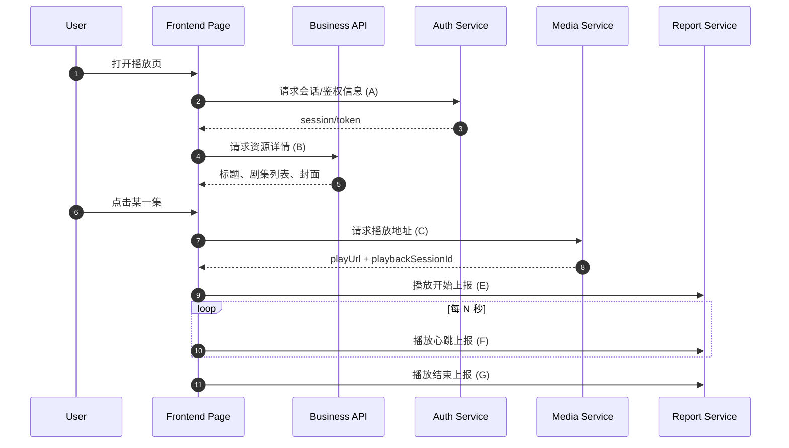

# API Flow Analysis Template (Compliant)

> 用途：用于梳理**你自有或已获授权**站点/服务的接口与业务流程。  
> 注意：请仅填写你有合法权限分析的目标系统。

## 1. 文档元信息

- 项目名称：
- 目标页面：
- 页面 URL：
- 环境（prod/staging/dev）：
- 分析日期：
- 分析人：
- 数据来源（抓包/网关日志/后端文档）：

---

## 2. 业务目标与范围

### 2.1 目标
- 这个页面解决什么业务问题？
- 用户在这个页面要完成什么动作？

### 2.2 范围
- 本文覆盖的流程：
- 本文不覆盖的流程：

---

## 3. 关键术语与对象

| 术语/对象 | 含义 | 关键字段 |
|---|---|---|
| User |  |  |
| Session |  |  |
| Episode |  |  |
| PlaybackToken |  |  |
| ReportEvent |  |  |

---

## 4. 接口清单（按调用先后）

> 建议按“页面初始化 -> 鉴权 -> 资源详情 -> 可播放地址 -> 播放上报 -> 推荐/评论”等顺序记录。

| 序号 | 接口名称 | Method | Path | 触发时机 | 入参 | 出参关键字段 | 鉴权方式 | 失败处理 | 依赖接口 |
|---|---|---|---|---|---|---|---|---|---|
| 1 |  | GET/POST |  | 页面进入 |  |  | Cookie/Bearer/None |  | - |
| 2 |  |  |  |  |  |  |  |  | 1 |
| 3 |  |  |  |  |  |  |  |  | 1,2 |

---

## 5. 业务流程拆解

### 5.1 页面初始化流程
1. 客户端加载页面。
2. 请求接口 A（例如：会话/配置）。
3. 基于接口 A 返回结果，请求接口 B（例如：资源详情）。
4. 渲染首屏数据。

### 5.2 选集/切换内容流程
1. 用户点击某一集（episodeId）。
2. 请求接口 C 获取该集可播放信息。
3. 更新播放器数据源并开始播放。
4. 记录行为上报（接口 D）。

### 5.3 播放过程上报流程
1. 播放开始上报（接口 E）。
2. 播放心跳上报（接口 F，周期性）。
3. 播放结束上报（接口 G）。

### 5.4 异常与降级流程
- token 过期：
- 播放地址失效：
- 地域/权限限制：
- 网络错误重试策略：

---

## 6. 接口依赖关系（文字版）

- 接口 A 是前置：A 失败会导致 B/C 不可调用。
- 接口 B 提供 `resourceId`，是 C 的输入。
- 接口 C 返回 `playUrl/token`，是播放器启动必需。
- 接口 E/F/G 依赖 C 返回的 `sessionId`。

---

## 7. 业务接口时序图（Mermaid）

> 复制到支持 Mermaid 的渲染器可直接出图。

---

## 8. 字段血缘（关键字段如何在接口间传递）

| 字段名 | 来源接口 | 去向接口 | 作用 |
|---|---|---|---|
| sessionToken | A | B/C/E/F/G | 鉴权 |
| resourceId | B | C | 标识播放资源 |
| episodeId | B/用户操作 | C | 标识具体剧集 |
| playbackSessionId | C | E/F/G | 关联播放会话 |

---

## 9. 状态机（可选）

- `idle` -> `loading` -> `ready` -> `playing` -> `paused` -> `ended`
- 错误态：`error_auth` / `error_media` / `error_network`

---

## 10. 风险与合规检查

- 是否包含用户隐私字段（手机号、设备标识、精确定位）？
- 是否符合最小化采集原则？
- 上报接口是否有幂等与重放保护？
- token 是否短时有效并且仅服务端签发？

---

## 11. 待补充项清单

- [ ] 补全全部接口 Path 与 Method
- [ ] 补全每个接口的请求/响应示例
- [ ] 补全失败码与重试策略
- [ ] 补全依赖关系与时序图编号对应

---

## 12. 示例：单个接口记录模板

### 接口：获取播放地址（示例）
- Method:
- Path:
- 触发时机:
- 请求头:
- Query/Body:
- 成功响应:
- 错误响应:
- 上游依赖:
- 下游影响:
- 备注:
